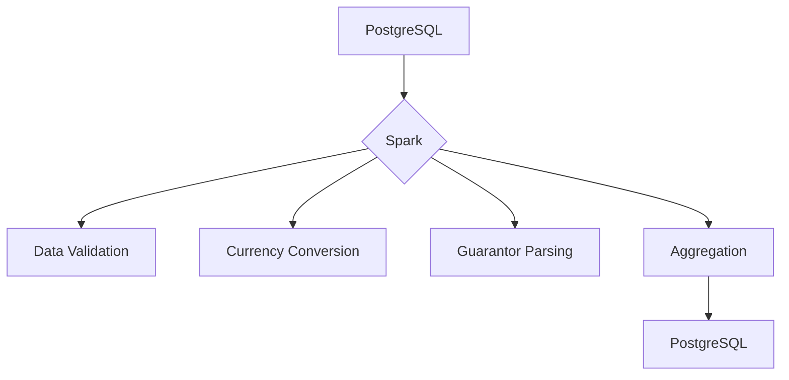

# Transaction Guarantee Reporting System 💰

A Spark-based solution for processing financial transactions with guarantor information, generating aggregated reports per country/guarantor. Built for scalability and compliance with financial data standards.

[](https://www.scala-lang.org/)
[](https://spark.apache.org/)
[](https://www.postgresql.org/)

## 🌟 Features
- Transaction processing with guarantor allocation
- Currency conversion to EUR using latest rates
- Receiver validation through registry checks
- Daily partitioned reporting
- Dual implementation (DataFrame API & Spark SQL)
- Integration with PostgreSQL
- Unit & integration testing suite

## 📚 Index
1. [Project Structure](#-project-structure)
2. [Core Modules](#-core-modules)
   - [Data Models](#data-models)
   - [Business Logic](#business-logic)
   - [PostgreSQL Connectivity](#postgresql-connectivity)
   - [Reporting Engine](#reporting-engine)
3. [Getting Started](#-getting-started)
4. [Test Strategy](#-test-strategy)
5. [Performance Notes](#-performance-notes)

## 🏗️ Project Structure

### Core Modules

#### **Data Models** (`data/Rows.scala`)
```scala
case class Transaction(...)          // Core transaction entity
case class Guarantee(...)            // Final report format
case class TransitoryRow(...)        // Intermediate processing format
object Rows                          // Schema definitions
```

#### **Business Logic**
| Module               | Purpose                          |
|----------------------|----------------------------------|
| `ParseGuarantors`    | JSON ➔ Guarantor list expansion  |
| `PivotTransactionType` | Transaction class aggregation  |
| `CheckRegisteredReceivers` | Receiver validation         |
| `EuroExchangeRates`  | Currency conversion              |

#### **PostgreSQL Connectivity** (`db/PostgresConnector.scala`)
```scala
class PostgresConnector            // Read/write JDBC operations
object PostgresConnector           // Factory methods
```

#### **Reporting Engine** (`Report.scala`, `SparkSqlReport.scala`)
```scala
object Report          // Parent type of reports
object SparkApiReport  // DataFrame API implementation
object SparkSqlReport  // Pure SQL implementation
```

### Support Modules
```scala
object Tables              // Dataset initialization
object JsonGuarantorParser // JSON parsing logic
```

## 🚀 Getting Started

### Prerequisites
- Scala 2.13
- Spark 3.5
- PostgreSQL 13+
- Docker (for integration tests)

### Setup
1. Start PostgreSQL:
```bash
docker-compose up -d
```

2. Run Spark job:
```bash
spark-submit --class com.alitariverdy.SparkApiReport \
  --master local[*] \
  target/scala-2.13/transaction-reporting_2.13-1.0.jar
```

## 🔍 Test Strategy

### Unit Tests
```scala
class DataSpec     // Data repositories tests
class BusinessSpec // Business conversions tests
```

### Integration Tests
```scala
class ReportSpec // Full pipeline test
```

Run tests:
```bash
sbt test
```

## ⚡ Performance Notes
- **Broadcast Join**: Used for small datasets (exchange rates, receivers)
- **Caching**: Critical tables cached in memory
- **Partitioning**: Daily partitioning for all datasets
- **Predicate Pushdown**: Optimized SQL queries

## 🧠 Design Philosophy


